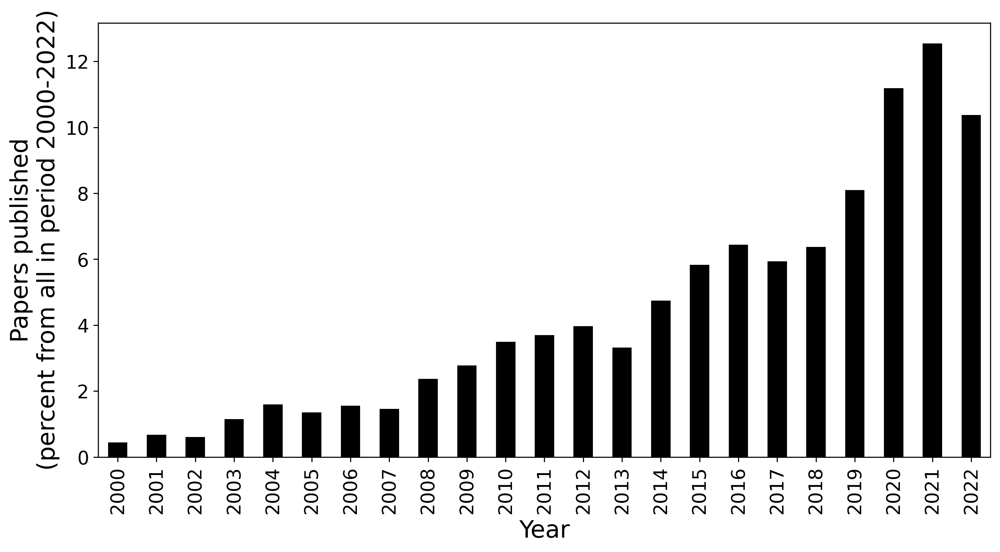
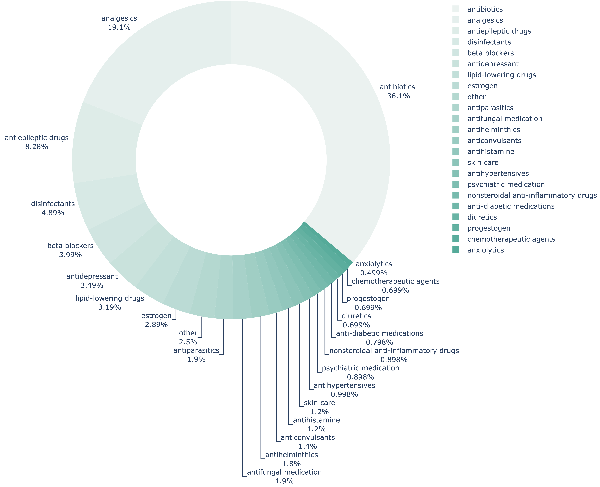
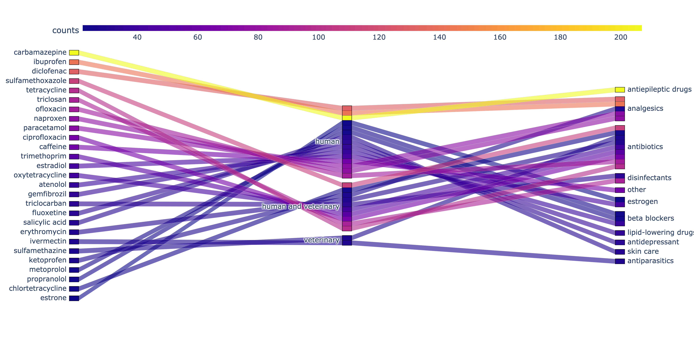

# Pharmaceuticals in soils research

## Objective

Here is the analytics of the research dedicated to pharmaceuticals' impact on natural environments with a focus on soils.

The problem of contamination of the environment by pharmaceuticals and products of personal care and hygiene (PPCP) is globally well recognised nowadays, due to the raising emergence of antimicrobial resistance. The largest part of pharmaceuticals entering natural media affects water resources at first, so most of the research is focused on the effects accompanying the pollution of water ecosystems. Another serious aspect of this problem is the introduction of PPCP into soils -- the largest pool of the global biodiversity, one of the major regulators of the global carbon and nutrient cycle, and the source of natural pharmaceuticals. Research dedicated to soils is not so often compared to water research, however, it is a valuable knowledge direction for a better understanding of shifts in the biosphere caused by different pollutants along with the development of regulatory actions required by the global urgency.

This analysis is a part of the systematic review "Influence of pharmaceuticals and personal care products’ occurrence on soil ecosystem functioning: traits, mechanisms and markers" prepared for the Environmental Science and Pollution Research journal.

The approach with the provided code example and results can be used for further state-of-the-art analysis on the topic. 

## Problem statement

The analytics answers the following questions:
1) What PPCP analytes are currently studied the most?
2) What are the main therapeutic groups that received most of the attention in the existing research?
3) Which publications drew most of the attention considering specific PPCP and year of publication?

## Information sources

The analysis is made on the openly distributed data relevant to the topic. The core information source is the sample of peer-reviewed scientific papers, selected by the keywords ``soil`` and ``pharmaceuticals`` occurred in titles and abstracts. The information on these publications, including titles and abstracts texts, were obtained from the Dimensions scientific database https://www.dimensions.ai for years from 2000 to 2022 (attached in the ``data`` folder), consisting of 2951 entries. To answer the questions above, the abstract texts were compared with entries from the database of Pharmaceuticals in the environment https://www.umweltbundesamt.de/en/database-pharmaceuticals-in-the-environment-0 of German Environment Agency -- Umwelt Bundesamt (UBA). After the exclusion of papers without mentions of PPCP from the UBA list in the abstract and manual cleaning of papers describing irrelevant environmental matrix 828 abstract entries were used for the final analysis.

## Google Colab

## Results

The resulting sample kept ~30% of initial entries which is equal to 828 abstracts containing mentions of 337 unique PPCPs.
For the main part of the analysis, unique PPCPs were sorted according to the frequency of their mentions in papers. A list of PPCPs which were mentioned in the abstracts of more than 10 papers was selected.

### Trends in pharmaceuticals-in-soils research

 
 

 
  

### Representation of therapeutic groups in soil research
 
 

### The most frequently studied PPCP analytes starting from 2017
 
 

### Recently (starting from 2017) published papers on the topic, drew most of the attention, and provided for top-15 most studied PPCP analytes (on Sept.2022)

| Title                                                                                                                                                                                                                                     | RefNum | Journal                                           | PubYear | Times cited | Pharmaceuticals                                                                                                                                                                                                                  | By PPCP          |
| ----------------------------------------------------------------------------------------------------------------------------------------------------------------------------------------------------------------------------------------- | ------ | ------------------------------------------------- | ------- | ----------- | -------------------------------------------------------------------------------------------------------------------------------------------------------------------------------------------------------------------------------- | ---------------- |
| [Composted biosolids and treated wastewater as sources of pharmaceuticals and personal care products for plant uptake: a case study with carbamazepine](https://doi.org/10.1016/j.envpol.2017.09.029)                                   | 0      | environmental pollution                           | 2017    | 78          | ['carbamazepine']                                                                                                                                                                                                              | carbamazepine    |
| [Diclofenac, carbamazepine and triclocarban biodegradation in agricultural soils and the microorganisms and metabolic pathways affected](https://doi.org/10.1016/j.scitotenv.2018.05.403)                                               | 1      | the science of the total environment              | 2018    | 64          | ['carbamazepine', 'diclofenac', 'triclocarban']                                                                                                                                                                                | carbamazepine    |
| [Uptake and accumulation of emerging contaminants in soil and plant treated with wastewater under real-world environmental conditions in the Al Hayer area (Saudi Arabia)](https://doi.org/10.1016/j.scitotenv.2018.10.224)             | 2      | the science of the total environment              | 2018    | 58          | ['atenolol', 'caffeine', 'carbamazepine', 'diazinon', 'gemfibrozil', 'ibuprofen', 'naproxen']                                                                                                                                  | carbamazepine    |
| [Sorption and degradation of contaminants of emerging concern in soils under aerobic and anaerobic conditions](https://doi.org/10.1016/j.scitotenv.2019.02.279)                                                                         | 3      | the science of the total environment              | 2019    | 53          | ['carbamazepine', 'chlorothiazide', 'diclofenac', 'gemfibrozil', 'hydrochlorothiazide', 'ibuprofen', 'nadolol', 'sulfamethizole', 'sulfamethoxazole']                                                                          | carbamazepine    |
| [Impacts of irrigation water sources and geochemical conditions on the vertical distribution of pharmaceutical and personal care products (ppcps) in the vadose zone soils](https://doi.org/10.1016/j.scitotenv.2018.01.168)                | 4      | the science of the total environment              | 2018    | 51          | ['caffeine', 'carbamazepine']                                                                                                                                                                                                  | carbamazepine    |
| [Uptake and accumulation of emerging contaminants in soil and plant treated with wastewater under real-world environmental conditions in the Al Hayer area (Saudi Arabia)](https://doi.org/10.1016/j.scitotenv.2018.10.224)             | 2      | the science of the total environment              | 2018    | 58          | ['atenolol', 'caffeine', 'carbamazepine', 'diazinon', 'gemfibrozil', 'ibuprofen', 'naproxen']                                                                                                                                  | ibuprofen        |
| [Sorption and desorption of selected non-steroidal anti-inflammatory drugs in an agricultural loam-textured soil](https://doi.org/10.1016/j.chemosphere.2017.02.027)                                                                    | 5      | chemosphere                                       | 2017    | 55          | ['diclofenac', 'ibuprofen', 'ketoprofen', 'naproxen']                                                                                                                                                                          | ibuprofen        |
| [Multi-residue determination of 47 organic compounds in water, soil, sediment and fish‚ Turia river as case study](https://doi.org/10.1016/j.jpba.2017.08.014)                                                                          | 6      | journal of pharmaceutical and biomedical analysis | 2017    | 53          | ['ibuprofen', 'metoprolol', 'paracetamol', 'sulfamethoxazole', 'vildagliptin']                                                                                                                                                 | ibuprofen        |
| [Sorption and degradation of contaminants of emerging concern in soils under aerobic and anaerobic conditions](https://doi.org/10.1016/j.scitotenv.2019.02.279)                                                                         | 3      | the science of the total environment              | 2019    | 53          | ['carbamazepine', 'chlorothiazide', 'diclofenac', 'gemfibrozil', 'hydrochlorothiazide', 'ibuprofen', 'nadolol', 'sulfamethizole', 'sulfamethoxazole']                                                                          | ibuprofen        |
| [Fate and impacts of pharmaceuticals and personal care products after repeated applications of organic waste products in long-term field experiments](https://doi.org/10.1016/j.scitotenv.2017.06.240)                                  | 7      | the science of the total environment              | 2017    | 49          | ['carbamazepine', 'diclofenac', 'doxycycline', 'ibuprofen', 'triclosan']                                                                                                                                                       | ibuprofen        |
| [Monitoring the occurrence of pharmaceuticals in soils irrigated with reclaimed wastewater](https://doi.org/10.1016/j.envpol.2017.12.085)                                                                                               | 8      | environmental pollution                           | 2018    | 108         | ['chlorothiazide', 'diclofenac', 'hydrochlorothiazide']                                                                                                                                                                        | diclofenac       |
| [Pharmaceuticals, pesticides, personal care products and microplastics contamination assessment of Al-Hassa irrigation network (Saudi Arabia) and its shallow lakes](https://doi.org/10.1016/j.scitotenv.2019.135021)                   | 9      | the science of the total environment              | 2019    | 75          | ['atorvastatin', 'caffeine', 'diazinon', 'diclofenac', 'lorazepam', 'metformin', 'ofloxacin', 'paracetamol', 'salicylic acid', 'tramadol']                                                                                     | diclofenac       |
| [Diclofenac, carbamazepine and triclocarban biodegradation in agricultural soils and the microorganisms and metabolic pathways affected](https://doi.org/10.1016/j.scitotenv.2018.05.403)                                               | 1      | the science of the total environment              | 2018    | 64          | ['carbamazepine', 'diclofenac', 'triclocarban']                                                                                                                                                                                | diclofenac       |
| [Sorption and desorption of selected non-steroidal anti-inflammatory drugs in an agricultural loam-textured soil](https://doi.org/10.1016/j.chemosphere.2017.02.027)                                                                    | 5      | chemosphere                                       | 2017    | 55          | ['diclofenac', 'ibuprofen', 'ketoprofen', 'naproxen']                                                                                                                                                                          | diclofenac       |
| [Sorption and degradation of contaminants of emerging concern in soils under aerobic and anaerobic conditions](https://doi.org/10.1016/j.scitotenv.2019.02.279)                                                                         | 3      | the science of the total environment              | 2019    | 53          | ['carbamazepine', 'chlorothiazide', 'diclofenac', 'gemfibrozil', 'hydrochlorothiazide', 'ibuprofen', 'nadolol', 'sulfamethizole', 'sulfamethoxazole']                                                                          | diclofenac       |
| [Enhanced adsorption of bisphenol a and sulfamethoxazole by a novel magnetic CuZnFe2O4–biochar composite](https://doi.org/10.1016/j.biortech.2019.02.091)                                                                               | 10     | bioresource technology                            | 2019    | 127         | ['sulfamethoxazole']                                                                                                                                                                                                           | sulfamethoxazole |
| [Sorption and degradation of contaminants of emerging concern in soils under aerobic and anaerobic conditions](https://doi.org/10.1016/j.scitotenv.2019.02.279)                                                                         | 3      | the science of the total environment              | 2019    | 53          | ['carbamazepine', 'chlorothiazide', 'diclofenac', 'gemfibrozil', 'hydrochlorothiazide', 'ibuprofen', 'nadolol', 'sulfamethizole', 'sulfamethoxazole']                                                                          | sulfamethoxazole |
| [Multi-residue determination of 47 organic compounds in water, soil, sediment and fish‚ Turia river as case study](https://doi.org/10.1016/j.jpba.2017.08.014)                                                                          | 6      | journal of pharmaceutical and biomedical analysis | 2017    | 53          | ['ibuprofen', 'metoprolol', 'paracetamol', 'sulfamethoxazole', 'vildagliptin']                                                                                                                                                 | sulfamethoxazole |
| [Effects of 18 pharmaceuticals on the physiological diversity of edaphic microorganisms](https://doi.org/10.1016/j.scitotenv.2017.04.002)                                                                                               | 11     | the science of the total environment              | 2017    | 44          | ['nadolol', 'sulfamethoxazole', 'tetracycline', 'trimethoprim']                                                                                                                                                                | sulfamethoxazole |
| [Occurrence and human health risk assessment of pharmaceuticals and personal care products in real agricultural systems with long-term reclaimed wastewater irrigation in Beijing, China](https://doi.org/10.1016/j.ecoenv.2019.110022) | 12     | ecotoxicology and environmental safety            | 2019    | 41          | ['sulfamethazine', 'sulfamethoxazole', 'sulfisoxazole', 'triclosan', 'trimethoprim']                                                                                                                                           | sulfamethoxazole |
| [A review of the occurrence of selected micropollutants and microorganisms in different raw and treated manure ‚ environmental risk due to antibiotics after application to soil](https://doi.org/10.1016/j.scitotenv.2019.136118)      | 13     | the science of the total environment              | 2019    | 66          | ['chlortetracycline', 'enrofloxacin', 'ofloxacin', 'oxytetracycline', 'sulfamethazine', 'tetracycline']                                                                                                                        | tetracycline     |
| [Veterinary pharmaceuticals and antibiotics in manure and slurry and their fate in amended agricultural soils: findings from an experimental field site (Baix Empordà, NE Catalonia)](https://doi.org/10.1016/j.scitotenv.2018.11.061)  | 14     | the science of the total environment              | 2018    | 59          | ['enrofloxacin', 'ofloxacin', 'tetracycline']                                                                                                                                                                                  | tetracycline     |
| [Novel antibiotic resistance determinants from agricultural soil exposed to antibiotics widely used in human medicine and animal farming](https://doi.org/10.1128/aem.00989-17)                                                         | 15     | applied and environmental microbiology            | 2017    | 50          | ['chlortetracycline', 'sulfamethazine', 'tetracycline', 'tylosin']                                                                                                                                                             | tetracycline     |
| [Effects of 18 pharmaceuticals on the physiological diversity of edaphic microorganisms](https://doi.org/10.1016/j.scitotenv.2017.04.002)                                                                                               | 11     | the science of the total environment              | 2017    | 44          | ['nadolol', 'sulfamethoxazole', 'tetracycline', 'trimethoprim']                                                                                                                                                                | tetracycline     |
| [Impact of chlortetracycline and sulfapyridine antibiotics on soil enzyme activities](https://doi.org/10.1515/intag-2016-0084)                                                                                                          | 16     | international agrophysics                         | 2017    | 34          | ['chlortetracycline', 'sulfapyridine', 'tetracycline']                                                                                                                                                                         | tetracycline     |
| [Fate and impacts of pharmaceuticals and personal care products after repeated applications of organic waste products in long-term field experiments](https://doi.org/10.1016/j.scitotenv.2017.06.240)                                  | 7      | the science of the total environment              | 2017    | 49          | ['carbamazepine', 'diclofenac', 'doxycycline', 'ibuprofen', 'triclosan']                                                                                                                                                       | triclosan        |
| [Carbamazepine, triclocarban and triclosan biodegradation and the phylotypes and functional genes associated with xenobiotic degradation in four agricultural soils](https://doi.org/10.1016/j.scitotenv.2018.12.145)                   | 17     | the science of the total environment              | 2018    | 44          | ['carbamazepine', 'triclocarban', 'triclosan']                                                                                                                                                                                 | triclosan        |
| [Occurrence and human health risk assessment of pharmaceuticals and personal care products in real agricultural systems with long-term reclaimed wastewater irrigation in Beijing, China](https://doi.org/10.1016/j.ecoenv.2019.110022) | 12     | ecotoxicology and environmental safety            | 2019    | 41          | ['sulfamethazine', 'sulfamethoxazole', 'sulfisoxazole', 'triclosan', 'trimethoprim']                                                                                                                                           | triclosan        |
| [Impact of inoculum sources on biotransformation of pharmaceuticals and personal care products](https://doi.org/10.1016/j.watres.2017.08.041)                                                                                           | 18     | water research                                    | 2017    | 35          | ['diclofenac', 'gabapentin', 'gemfibrozil', 'ibuprofen', 'triclosan']                                                                                                                                                          | triclosan        |
| [Innovative application of biobed bioremediation systems to remove emerging contaminants: adsorption, degradation and bioaccesibility](https://doi.org/10.1016/j.scitotenv.2018.09.268)                                                 | 19     | the science of the total environment              | 2018    | 29          | ['diclofenac', 'ibuprofen', 'triclosan']                                                                                                                                                                                       | triclosan        |
| [Pharmaceuticals, pesticides, personal care products and microplastics contamination assessment of al-hassa irrigation network (saudi arabia) and its shallow lakes](https://doi.org/10.1016/j.scitotenv.2019.135021)                   | 9      | the science of the total environment              | 2019    | 75          | ['atorvastatin', 'caffeine', 'diazinon', 'diclofenac', 'lorazepam', 'metformin', 'ofloxacin', 'paracetamol', 'salicylic acid', 'tramadol']                                                                                     | ofloxacin        |
| [A review of the occurrence of selected micropollutants and microorganisms in different raw and treated manure environmental risk due to antibiotics after application to soil](https://doi.org/10.1016/j.scitotenv.2019.136118)        | 13     | the science of the total environment              | 2019    | 66          | ['chlortetracycline', 'enrofloxacin', 'ofloxacin', 'oxytetracycline', 'sulfamethazine', 'tetracycline']                                                                                                                        | ofloxacin        |
| [Veterinary pharmaceuticals and antibiotics in manure and slurry and their fate in amended agricultural soils: findings from an experimental field site (Baix Empordà, NE catalonia)](https://doi.org/10.1016/j.scitotenv.2018.11.061)  | 14     | the science of the total environment              | 2018    | 59          | ['enrofloxacin', 'ofloxacin', 'tetracycline']                                                                                                                                                                                  | ofloxacin        |
| [Natural soil mediated photo fenton-like processes in treatment of pharmaceuticals: batch and continuous approach](https://doi.org/10.1016/j.chemosphere.2017.09.016)                                                                   | 20     | chemosphere                                       | 2017    | 28          | ['ofloxacin', 'ornidazole']                                                                                                                                                                                                    | ofloxacin        |
| [Pharmaceuticals and trace metals in the surface water used for crop irrigation: risk to health or natural attenuation?](https://doi.org/10.1016/j.scitotenv.2019.135825)                                                               | 21     | the science of the total environment              | 2019    | 27          | ['acetaminophen', 'carbamazepine', 'ciprofloxacin', 'ibuprofen', 'ofloxacin']                                                                                                                                                  | ofloxacin        |
| [Uptake and accumulation of emerging contaminants in soil and plant treated with wastewater under real-world environmental conditions in the Al Hayer area (Saudi Arabia)](https://doi.org/10.1016/j.scitotenv.2018.10.224)             | 2      | the science of the total environment              | 2018    | 58          | ['atenolol', 'caffeine', 'carbamazepine', 'diazinon', 'gemfibrozil', 'ibuprofen', 'naproxen']                                                                                                                                  | naproxen         |
| [Sorption and desorption of selected non-steroidal anti-inflammatory drugs in an agricultural loam-textured soil](https://doi.org/10.1016/j.chemosphere.2017.02.027)                                                                    | 5      | chemosphere                                       | 2017    | 55          | ['diclofenac', 'ibuprofen', 'ketoprofen', 'naproxen']                                                                                                                                                                          | naproxen         |
| [Spatial distribution of pharmaceuticals in conventional wastewater treatment plant with sludge treatment reed beds technology](https://doi.org/10.1016/j.scitotenv.2018.07.439)                                                        | 22     | the science of the total environment              | 2018    | 39          | ['diclofenac', 'flurbiprofen', 'ibuprofen', 'naproxen', 'paracetamol']                                                                                                                                                         | naproxen         |
| [A review of selected microcontaminants and microorganisms in land runoff and tile drainage in treated sludge-amended soils](https://doi.org/10.1016/j.scitotenv.2018.11.249)                                                           | 23     | the science of the total environment              | 2018    | 21          | ['acetaminophen', 'carbamazepine', 'gemfibrozil', 'ibuprofen', 'naproxen', 'sulfamethoxazole', 'triclocarban', 'triclosan']                                                                                                    | naproxen         |
| [Mobility of pharmaceutical and personal care products in lime amended wastewater biosolids](https://doi.org/10.1016/j.scitotenv.2017.12.243)                                                                                           | 24     | the science of the total environment              | 2017    | 19          | ['carbamazepine', 'erythromycin', 'fluoxetine', 'gemfibrozil', 'naproxen', 'triclosan']                                                                                                                                        | naproxen         |
| [Pharmaceuticals, pesticides, personal care products and microplastics contamination assessment of Al-Hassa irrigation network (Saudi Arabia) and its shallow lakes](https://doi.org/10.1016/j.scitotenv.2019.135021)                   | 9      | the science of the total environment              | 2019    | 75          | ['atorvastatin', 'caffeine', 'diazinon', 'diclofenac', 'lorazepam', 'metformin', 'ofloxacin', 'paracetamol', 'salicylic acid', 'tramadol']                                                                                     | paracetamol      |
| [Multi-residue determination of 47 organic compounds in water, soil, sediment and fish‚ Turia river as case study](https://doi.org/10.1016/j.jpba.2017.08.014)                                                                          | 6      | journal of pharmaceutical and biomedical analysis | 2017    | 53          | ['ibuprofen', 'metoprolol', 'paracetamol', 'sulfamethoxazole', 'vildagliptin']                                                                                                                                                 | paracetamol      |
| [Spatial distribution of pharmaceuticals in conventional wastewater treatment plant with sludge treatment reed beds technology](https://doi.org/10.1016/j.scitotenv.2018.07.439)                                                        | 22     | the science of the total environment              | 2018    | 39          | ['diclofenac', 'flurbiprofen', 'ibuprofen', 'naproxen', 'paracetamol']                                                                                                                                                         | paracetamol      |
| [Individual and mixture toxicity evaluation of three pharmaceuticals to the germination and growth of Lactuca Sativa seeds](https://doi.org/10.1016/j.scitotenv.2019.03.432)                                                            | 25     | the science of the total environment              | 2019    | 33          | ['amoxicillin', 'ibuprofen', 'paracetamol']                                                                                                                                                                                    | paracetamol      |
| [Uptake and toxicological effects of pharmaceutical active compounds on maize](https://doi.org/10.1016/j.agee.2018.02.022)                                                                                                              | 26     | agriculture ecosystems & environment              | 2018    | 24          | ['paracetamol']                                                                                                                                                                                                                | paracetamol      |
| [Pharmaceuticals and trace metals in the surface water used for crop irrigation: risk to health or natural attenuation?](https://doi.org/10.1016/j.scitotenv.2019.135825)                                                               | 21     | the science of the total environment              | 2019    | 27          | ['acetaminophen', 'carbamazepine', 'ciprofloxacin', 'ibuprofen', 'ofloxacin']                                                                                                                                                  | ciprofloxacin    |
| [Occurrence of pharmaceuticals and their metabolites in sewage sludge and soil: a review on their distribution and environmental risk assessment](https://doi.org/10.1016/j.teac.2021.e00125)                                           | 27     | trends in environmental analytical chemistry      | 2021    | 27          | ['ciprofloxacin', 'estradiol', 'ofloxacin', 'triclocarban', 'triclosan']                                                                                                                                                       | ciprofloxacin    |
| [Pharmaceuticals, herbicides, and disinfectants in agricultural water sources](https://doi.org/10.1016/j.envres.2019.04.011)                                                                                                            | 28     | environmental research                            | 2019    | 25          | ['azithromycin', 'caffeine', 'ciprofloxacin', 'ofloxacin', 'sulfamethoxazole']                                                                                                                                                 | ciprofloxacin    |
| [Occurrence, fate and environmental risk assessment of pharmaceutical compounds in soils amended with organic wastes](https://doi.org/10.1016/j.geoderma.2020.114498)                                                                   | 29     | geoderma                                          | 2020    | 21          | ['carbamazepine', 'ciprofloxacin', 'diclofenac', 'norfloxacin', 'ofloxacin', 'sulfadiazine', 'sulfamethoxazole', 'sulfamethoxypyridazine', 'trimethoprim', 'tylosin']                                                          | ciprofloxacin    |
| [Comparative study on degradation of norfloxacin and ciprofloxacin by Ganoderma lucidum JAPC1](https://doi.org/10.1007/s11814-016-0345-6)                                                                                               | 30     | korean journal of chemical engineering            | 2017    | 19          | ['ciprofloxacin', 'norfloxacin', 'ofloxacin']                                                                                                                                                                                  | ciprofloxacin    |
| [Pharmaceuticals, pesticides, personal care products and microplastics contamination assessment of Al-Hassa irrigation network (Saudi Arabia) and its shallow lakes](https://doi.org/10.1016/j.scitotenv.2019.135021)                   | 9      | the science of the total environment              | 2019    | 75          | ['atorvastatin', 'caffeine', 'diazinon', 'diclofenac', 'lorazepam', 'metformin', 'ofloxacin', 'paracetamol', 'salicylic acid', 'tramadol']                                                                                     | caffeine         |
| [Uptake and accumulation of emerging contaminants in soil and plant treated with wastewater under real-world environmental conditions in the Al Hayer area (Saudi Arabia)](https://doi.org/10.1016/j.scitotenv.2018.10.224)             | 2      | the science of the total environment              | 2018    | 58          | ['atenolol', 'caffeine', 'carbamazepine', 'diazinon', 'gemfibrozil', 'ibuprofen', 'naproxen']                                                                                                                                  | caffeine         |
| [Impacts of irrigation water sources and geochemical conditions on vertical distribution of pharmaceutical and personal care products (PPCPs) in the vadose zone soils](https://doi.org/10.1016/j.scitotenv.2018.01.168)                | 4      | the science of the total environment              | 2018    | 51          | ['caffeine', 'carbamazepine']                                                                                                                                                                                                  | caffeine         |
| [Occurrence, fate, persistence and remediation of caffeine: a review](https://doi.org/10.1007/s11356-019-06998-8)                                                                                                                       | 31     | environmental science and pollution research      | 2019    | 47          | ['caffeine']                                                                                                                                                                                                                   | caffeine         |
| [Pharmaceuticals and personal care products in a mediterranean coastal wetland: impact of anthropogenic and spatial factors and environmental risk assessment](https://doi.org/10.1016/j.envpol.2020.116353)                            | 32     | environmental pollution                           | 2020    | 33          | ['caffeine', 'diclofenac', 'furosemide', 'ibuprofen', 'metformin', 'salicylic acid', 'tramadol']                                                                                                                               | caffeine         |
| [Effects of 18 pharmaceuticals on the physiological diversity of edaphic microorganisms](https://doi.org/10.1016/j.scitotenv.2017.04.002)                                                                                               | 11     | the science of the total environment              | 2017    | 44          | ['nadolol', 'sulfamethoxazole', 'tetracycline', 'trimethoprim']                                                                                                                                                                | trimethoprim     |
| [Occurrence and human health risk assessment of pharmaceuticals and personal care products in real agricultural systems with long-term reclaimed wastewater irrigation in Beijing, China](https://doi.org/10.1016/j.ecoenv.2019.110022) | 12     | ecotoxicology and environmental safety            | 2019    | 41          | ['sulfamethazine', 'sulfamethoxazole', 'sulfisoxazole', 'triclosan', 'trimethoprim']                                                                                                                                           | trimethoprim     |
| [Uptake and bioaccumulation of three widely prescribed pharmaceutically active compounds in tomato fruits and mediated effects on fruit quality attributes](https://doi.org/10.1016/j.scitotenv.2018.08.053)                            | 33     | the science of the total environment              | 2018    | 25          | ['diclofenac', 'sulfamethoxazole', 'trimethoprim']                                                                                                                                                                             | trimethoprim     |
| [Uptake and accumulation of pharmaceuticals in overhead- and surface-irrigated greenhouse lettuce](https://doi.org/10.1021/acs.jafc.7b04355)                                                                                            | 34     | journal of agricultural and food chemistry        | 2018    | 25          | ['caffeine', 'carbamazepine', 'monensin', 'sulfadiazine', 'sulfamethoxazole', 'trimethoprim', 'tylosin']                                                                                                                       | trimethoprim     |
| [Removal of selected pharmaceuticals and personal care products in reclaimed water during simulated managed aquifer recharge](10.1016/j.scitotenv.2018.05.221)                                                                          | 35     | the science of the total environment              | 2018    | 21          | ['atenolol', 'carbamazepine', 'lincomycin', 'primidone', 'propranolol', 'sulfamethazine', 'trimethoprim']                                                                                                                      | trimethoprim     |
| [Occurrence of pharmaceuticals and their metabolites in sewage sludge and soil: a review on their distribution and environmental risk assessment](https://doi.org/10.1016/j.teac.2021.e00125)                                           | 27     | trends in environmental analytical chemistry      | 2021    | 27          | ['ciprofloxacin', 'estradiol', 'ofloxacin', 'triclocarban', 'triclosan']                                                                                                                                                       | estradiol        |
| [Biosorption of pharmaceutical products by mushroom stem waste](https://doi.org/10.1016/j.chemosphere.2019.124515)                                                                                                                      | 36     | chemosphere                                       | 2019    | 23          | ['estradiol', 'paracetamol']                                                                                                                                                                                                   | estradiol        |
| [Impact of biochar amendment on the uptake, fate and bioavailability of pharmaceuticals in soil-radish systems](https://doi.org/10.1016/j.jhazmat.2020.122852)                                                                          | 37     | journal of hazardous materials                    | 2020    | 17          | ['acetaminophen', 'caffeine', 'carbadox', 'carbamazepine', 'estradiol', 'estrone', 'lamotrigine', 'lincomycin', 'oxytetracycline', 'sulfadiazine', 'sulfamethoxazole', 'tetracycline', 'triclosan', 'trimethoprim', 'tylosin'] | estradiol        |
| [Prioritizing environmental risks of pharmaceuticals and personal care products in reclaimed water on urban green space in Beijing](https://doi.org/10.1016/j.scitotenv.2019.133850)                                                    | 38     | the science of the total environment              | 2019    | 15          | ['estradiol', 'medroxyprogesterone', 'medroxyprogesterone acetate', 'megestrol', 'megestrol acetate', 'ofloxacin', 'progesterone', 'roxithromycin', 'sulfamethoxazole']                                                        | estradiol        |
| [Influence of the cell design in the electroremoval of ppcps from soil slurry](https://doi.org/10.1016/j.cej.2017.05.148)                                                                                                               | 39     | chemical engineering journal                      | 2017    | 12          | ['estradiol']                                                                                                                                                                                                                  | estradiol        |
| [A review of the occurrence of selected micropollutants and microorganisms in different raw and treated manure‚ environmental risk due to antibiotics after application to soil](https://doi.org/10.1016/j.scitotenv.2019.136118)       | 13     | the science of the total environment              | 2019    | 66          | ['chlortetracycline', 'enrofloxacin', 'ofloxacin', 'oxytetracycline', 'sulfamethazine', 'tetracycline']                                                                                                                        | oxytetracycline  |
| [A new approach for the extraction of tetracyclines from soil matrices: application of the microwave-extraction technique](https://doi.org/10.1007/s00216-017-0815-7)                                                                   | 40     | analytical and bioanalytical chemistry            | 2018    | 17          | ['chlortetracycline', 'oxytetracycline', 'tetracycline']                                                                                                                                                                       | oxytetracycline  |
| [Impact of biochar amendment on the uptake, fate and bioavailability of pharmaceuticals in soil-radish systems](https://doi.org/10.1016/j.jhazmat.2020.122852)                                                                          | 37     | journal of hazardous materials                    | 2020    | 17          | ['acetaminophen', 'caffeine', 'carbadox', 'carbamazepine', 'estradiol', 'estrone', 'lamotrigine', 'lincomycin', 'oxytetracycline', 'sulfadiazine', 'sulfamethoxazole', 'tetracycline', 'triclosan', 'trimethoprim', 'tylosin'] | oxytetracycline  |
| [Biochar affects the dissipation of antibiotics and abundance of antibiotic resistance genes in pig manure](https://doi.org/10.1016/j.biortech.2020.123782)                                                                             | 41     | bioresource technology                            | 2020    | 16          | ['ciprofloxacin', 'florfenicol', 'ofloxacin', 'oxytetracycline', 'sulfamethazine', 'tetracycline']                                                                                                                             | oxytetracycline  |
| [UV/VIS light induced degradation of oxytetracycline hydrochloride mediated by co-tio2 nanoparticles](https://doi.org/10.3390/molecules25020249)                                                                                        | 42     | molecules                                         | 2020    | 15          | ['oxytetracycline', 'tetracycline', 'tetracycline hydrochloride']                                                                                                                                                              | oxytetracycline  |
| [Uptake and accumulation of emerging contaminants in soil and plant treated with wastewater under real-world environmental conditions in the Al hayer area (Saudi Arabia)](https://doi.org/10.1016/j.scitotenv.2018.10.224)             | 2      | the science of the total environment              | 2018    | 58          | ['atenolol', 'caffeine', 'carbamazepine', 'diazinon', 'gemfibrozil', 'ibuprofen', 'naproxen']                                                                                                                                  | atenolol         |
| [Root uptake of atenolol, sulfamethoxazole and carbamazepine, and their transformation in three soils and four plants](https://doi.org/10.1007/s11356-019-04333-9)                                                                      | 43     | environmental science and pollution research      | 2019    | 39          | ['atenolol', 'carbamazepine', 'sulfamethoxazole']                                                                                                                                                                              | atenolol         |
| [Sorption of pharmaceuticals to soil organic matter in a constructed wetland by electrostatic interaction](https://doi.org/10.1016/j.scitotenv.2018.04.212)                                                                             | 44     | the science of the total environment              | 2018    | 38          | ['atenolol', 'carbamazepine', 'ibuprofen']                                                                                                                                                                                     | atenolol         |
| [Uptake of atenolol, carbamazepine and triclosan by crops irrigated with reclaimed water in a mediterranean scenario](https://doi.org/10.1016/j.ecoenv.2020.110171)                                                                     | 45     | ecotoxicology and environmental safety            | 2020    | 26          | ['atenolol', 'carbamazepine', 'triclosan']                                                                                                                                                                                     | atenolol         |
| [Removal of selected pharmaceuticals and personal care products in reclaimed water during simulated managed aquifer recharge](https://doi.org/10.1016/j.scitotenv.2018.05.221)                                                          | 35     | the science of the total environment              | 2018    | 21          | ['atenolol', 'carbamazepine', 'lincomycin', 'primidone', 'propranolol', 'sulfamethazine', 'trimethoprim']                                                                                                                      | atenolol         |

## Limitations
* described PPCP can be related to the different groups of therapeutic usage within the same target group or between different target groups;
* incomplete keywords for the search -- however, the analytical sample is large enough to make main conclusions;
* incomplete information provided in abstract only -- for the full analysis it might be better to utilise the section "Materials and Methods" to determine both the environmental matrix and studied pharmaceuticals;
* an incomplete list of words and phrases for search is provided in the UBA database. However, the database collects information on PPCP detected in natural environments, so it is worth taking it into account. 
Some of the limitations resulted in 2 manual manipulations: search of papers with irrelevant matrix (can be fixed with the use of materials and methods section and more sophisticated approach to analysing texts), a search of PPCPs not included in search base (can be fixed by use of another database for comparison).

## Acknowledgements
The study was supported by the Russian Science Foundation grant No. 22-24-01103, https://rscf.ru/project/22-24-01103/

