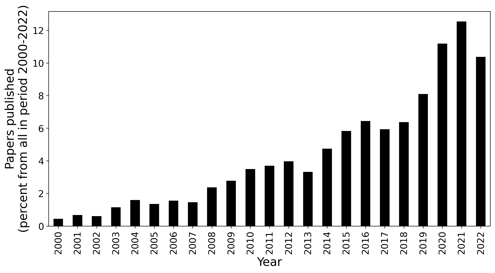
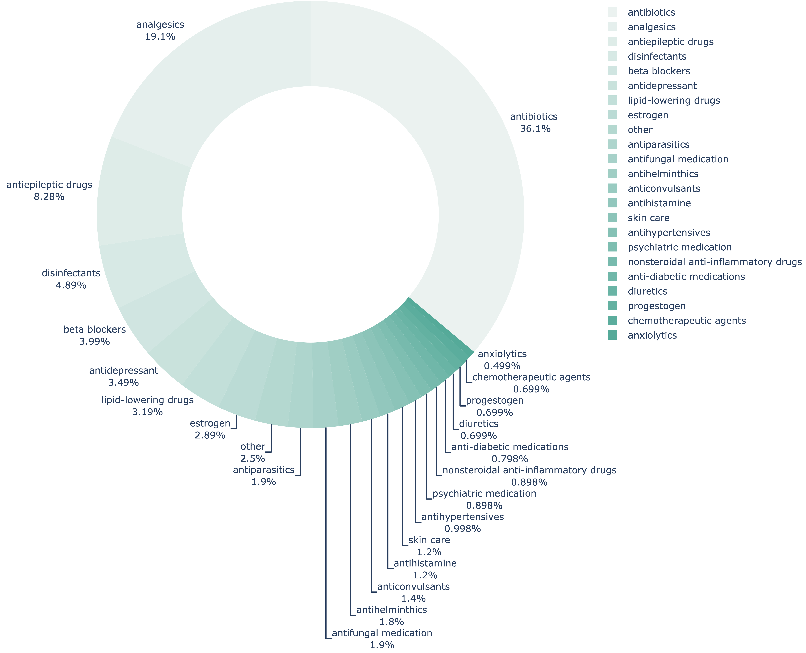
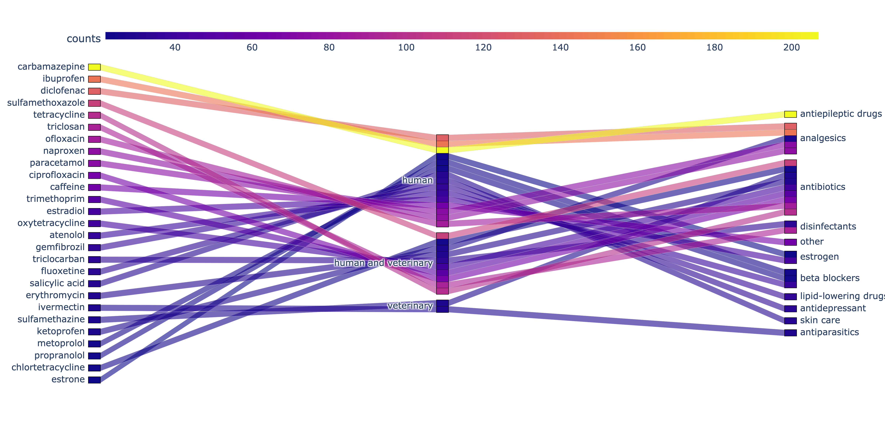

# Pharmaceuticals in soils research

## Objective

Here is the analytics of the research dedicated to pharmaceuticals' impact on natural environments with a focus on soils.

The problem of contamination of the environment by pharmaceuticals and products of personal care and hygiene (PPCP) is globally well recognised nowadays, due to the raising emergence of antimicrobial resistance. The largest part of pharmaceuticals entering natural media affects water resources at first, so most of the research is focused on the effects accompanying the pollution of water ecosystems. Another serious aspect of this problem is the introduction of PPCP into soils -- the largest pool of the global biodiversity, one of the major regulators of the global carbon and nutrient cycle, and the source of natural pharmaceuticals. Research dedicated to soils is not so often comparing to water research, however, it is a valuable knowledge direction for a better understanding of shifts in the biosphere caused by different pollutants along with the development of regulatory actions required by the global urgency.

This analysis is a part of the systematic review "Influence of pharmaceuticals and personal care products’ occurrence on soil ecosystem functioning: traits, mechanisms and markers" prepared for the Environmental Science & Technology journal.

This analysis is a part of the systematic review "Influence of pharmaceuticals and personal care products’ occurrence on soil ecosystem functioning: traits, mechanisms and markers" prepared for the Environmental Science & Technology journal.
The approach with the provided code example and results can be used for further state-of-the-art analysis on the topic. 

## Problem statement

The analytics answers the following questions:
1) What PPCP analytes are currently studied the most?
2) What are the main therapeutic groups that received most of the attention in the existing research?
3) Which publications drew most of the attention considering specific PPCP and year of publication?

## Information sources

The analysis is made on the openly distributed data relevant to the topic. The core information source is the sample of peer-reviewed scientific papers, selected by the keywords ``soil`` and ``pharmaceuticals`` occurred in titles and abstracts. The information on these publications, including titles and abstracts texts, were obtained from the Dimensions scientific database https://www.dimensions.ai for years from 2000 to 2020 (attached in the ``data`` folder), consisting of 2951 entries. To answer the questions above, the abstract texts were compared with entries from the database of Pharmaceuticals in the environment https://www.umweltbundesamt.de/en/database-pharmaceuticals-in-the-environment-0 of German Environment Agency -- Umwelt Bundesamt (UBA). After the exclusion of papers without mentions of PPCP from the UBA list in the abstract and manual cleaning of papers describing irrelevant environmental matrix 828 abstract entries were used for the final analysis.

## Results

The resulting sample kept ~30% of initial entries which is equal to 828 abstracts contains mentiones of 337 unique PPCPs.
For the main part of analysis unique PPCPs were sorted according to the frequency of their mentions in papers. List of PPCPs which were mentioned in the abstratcs of more than 10 papers were selected.

### Trends in pharmaceuticals-in-soils research

 
 

 
  

### Representation of therapeutic groups in soil research
 
 

### The most frequently studied PPCP analytes starting from 2017
 
 

=======

### Representation of therapeutic groups in soil research

### The most frequently studied PPCP analytes

| Tables        | Are           | Cool  |
| ------------- |:-------------:| -----:|
| col 3 is      | right-aligned | $1600 |
| col 2 is      | centered      |   $12 |
| zebra stripes | are neat      |    $1 |

### Recently (strting from 2017) published papers on the topic, drew most of the attention, provided for top-15 most studied PPCP analytes 

## Limitations
* described PPCP can be related to the different groups of therapeutic usage within the same target group or between different target groups;
* incomplete keywords for the search -- however, the analytical sample is large enough to make main conclusions;
* incomplete information provided in abstract only -- for the full analysis it might be better to utilise the section "Materials and Methods" to determine both the environmental matrix and studied pharmaceuticals;
* incomplete list of words and phrases for search provided in UBA database. However, the database collects the information of PPCP detected in natural environments, so it is worth to take it into account. 
Some of limitations resulted in 2 manual manipulations: search of papers with irrelevant matrix (can be fixed with use of materials and methods section and more sophisticated approach to analyse texts), search of PPCPs not included into search base (can be fixed by use of another database for comparison).

## Acknowledgements
The study was supported by the Russian Science Foundation grant No. 22-24-01103, https://rscf.ru/project/22-24-01103/
